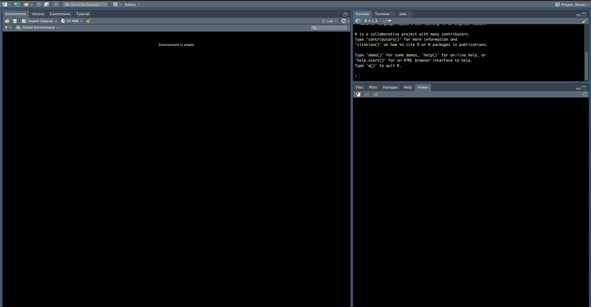
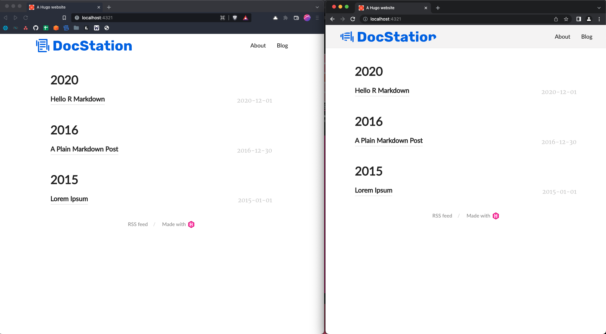
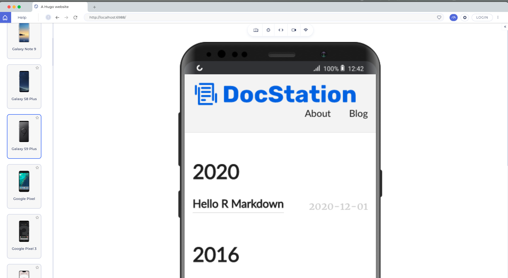
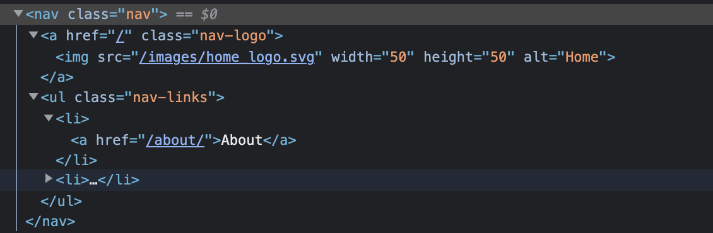

```{css, echo = F}
```

## Background
I've created a few different versions of my blog using blogdown. Creating new blog with blogdown is so simple, but customizing can be finicky. I started writing a post to document the process when I migrated to blogdown 1.0, but was still sitting in a stack of posts that never made their way to the web when I started writing this :flushed: Now a year later I'm hoping to use blogdown internally at my new job to disseminate analysis more easily and I could really use that post as a guide :scream: So, for posterity I'm going to document the process as I go through it. If you'd like to learn how to create blogdown site or learn how to customize on your existing blogdown site, read on.\

### What is blogdown?  
[blogdown](https://pkgs.rstudio.com/blogdown/) is an R package witten by [Yihui Xie](https://en.wikipedia.org/wiki/Yihui_Xie)  that wraps the [Hugo web development framework](https://gohugo.io/). Blogdown provides a tool for R developers to build their own blogs and portfolio sites from Hugo templates. There are several other R libraries to consider for publishing including [distill](https://pkgs.rstudio.com/blogdown/), [bookdown](https://pkgs.rstudio.com/bookdown/), and [hugodown](https://hugodown.r-lib.org/). You can read the sites to get a feel for the differences, but blogdown and hugodown seem best suited for my purposes. I would love to go with hugodown for the separation of duties it aims to provide, but I toyed with it and couldn't get off the ground and given it is still listed as `experimental` I think I'm better off going with blogdown at the moment.\

#### Learning blogdown
If you're new to blogdown I recommend this article from [Alison Presmanes Hill Hill](https://www.apreshill.com/blog/2020-12-new-year-new-blogdown/). Alison spent a few years working on the RStudio team and her blog is loaded with blogdown walkthroughs and gotcha's I highly recommend looking through her blog for other content. Additionally, Yihui wrote a [blogdown book](https://bookdown.org/yihui/blogdown/) that I always keep handy. Finally, I occasionally look through Yihui's [stack overflow answers](https://stackoverflow.com/users/559676/yihui-xie) just to find tidbits of info about how rmarkdown, knitr, blogdown, etc. really work because they are so complicated and black-box like... It's not specifically a resource for blogdown, but blogdown relies on the knitr and rmarkdown infrastructure so it helps to understand those packages behind the package.\

### What is Hugo?  
[Hugo](https://gohugo.io/about/what-is-hugo/) is a web development framework used to build [static websites](https://www.geeksforgeeks.org/static-vs-dynamic-website/). It's is one of the [most popular static site generators](https://jamstack.org/generators/) available at this time. If you're looking to use blogdown, you do not necessarily need to know almost anything about Hugo to succeed. However, the more you understand Hugo the easier it becomes to customize your site, debug, etc.\

#### Learning Hugo
I'll cover some of the basics in the next section, but I'll barely scratch the surface on Hugo. If you want to learn more, the [Hugo documentation](https://gohugo.io/getting-started/quick-start/) and a [youtube playlist](https://www.youtube.com/watch?v=qtIqKaDlqXo&list=PLLAZ4kZ9dFpOnyRlyS-liKL5ReHDcj4G3) Hugo provides are both good resources. I also found this [tutorial](https://webdesign.tutsplus.com/courses/getting-started-with-hugo-free-static-website-framework) by Adi Purdila useful. I haven't gone through and built my own Hugo site outside blogdown, but just watching the tutorial helped me understand how Hugo works for customization. This is probably a great starting point if you want to learn how to build your own template, but I'm not going there just yet...\

{width=500px}\

## Prerequisites
If you've never done web development at all there are some basic concepts and tools that are important to understand, but given that most of us have been on the internet for a few decades the learning curve isn't too bad. I am not a web developer and have no business teaching web development so please take all this with a grain of salt. The reason I decided to spend time on it is simply that building and customizing a blogdown site requires very basic knowledge of web development. As I was writing the walk through I kept coming back to these concepts and it felt disingenous to write the post without making some attempt to cover them - knowing and acknowledging that my attempt will probably be clumsy at best :grimacing: \

### HTML (HyperText Markup Language)
[HTML](https://simple.wikipedia.org/wiki/HTML) is the primary building block of web pages. There's a ton to learn about HTML. I recommend [w3school's HTML tutorial](https://www.w3schools.com/html/default.asp) if you want to get a broad understanding. The two things I'd definitely recommend reviewing are [HTML elements](https://www.w3schools.com/html/html_elements.asp) (aka HTML tags) and [HTML attributes](https://www.w3schools.com/html/html_attributes.asp). I always keep these lists of [HTML elements](https://www.w3schools.com/tags/default.asp) and [HTML attributes](https://www.w3schools.com/tags/ref_attributes.asp) handy.\

### CSS (Cascading Style Sheets)
[CSS](https://www.w3schools.com/whatis/whatis_css.asp) is code used to describe how html elements are to be displayed on a webpage, CSS "styles" a webpage. I borrowed the below image from a [css-tricks post](https://css-tricks.com/that-time-i-tried-browsing-the-web-without-css/), but the image on the right shows what Wikipedia's homepage would look like without CSS.\ 

{width=800px}\

Again, I recommend [w3school's CSS tutorial](https://www.w3schools.com/Css/) to get a broad understanding of CSS. If you want to do something to style your site search it and don't be afraid to post on stackoverflow. I find a lot of really specific CSS implementations on there that I've tried to jam into my personal site over time. Time more you do it the easier it gets. What you need to know in CSS can be especially specific to your goal, but I'd recommend reviewing [CSS syntax](https://www.w3schools.com/Css/css_syntax.asp) and [CSS selectors](https://www.w3schools.com/Css/css_selectors.asp) regardless because they're very useful and fundamental.\

### Browser Developer Tools
The [browser web developer tools](https://en.wikipedia.org/wiki/Web_development_tools) that come in your standard issue web browser are critical to working on web development. The most commonly used tool within the set is the element inspector which usually is represented by a little square with an arrow in the corner. This video shows a few ways you can use the element inspector.\

```{r, echo=F}
blogdown::shortcode("youtube", "vi1mUy-nXFo")
```

Using the element inspector allows you to find code related to an element so you can understand the code and make changes. We can try it on David Robinson's [website](http://varianceexplained.org/) by  [opening web developer tools](https://www.lifewire.com/how-to-clear-cache-2617980), selecting the image of David, and changing the image link to another image on the web.\

{width=800px}\

Changing the content can be useful for obvious reasons, but we can also modify the CSS around objects. We might not want the radial border around the image. We can find that CSS property if we select the image and look in the styles tab. Finding the right CSS property can require some knowledge, but it's usually not too hard to figure looking at the different names and tinkering. David's picture is inside an html `img` tag which contains a class `class="bio-photo`. The styles tab has a CSS selector called `.article-author-side .bio-photo`. That CSS selector has a property called `border-radius`. Un-check that property and see what the site would look like without it. A note, many of the bigger sites use system generated class names and things of that nature which can make this approach break down quickly.\

{width=800px}\

We can also add new properties to see what a change might look like. Knowing all the styling options you can use is overwhelming, but just search by the html tag name, in this case `img`, and "CSS properties" (i.e. [search img CSS properties](https://duckduckgo.com/?q=img+css+properties&atb=v314-1&ia=web)) and you'll usually get useful results. On this one I ended up back at  [w3schools CSS tutorial](https://www.w3schools.com/css/css3_images.asp).\

{width=800px}\

We could probably take this pretty far, but I'll cover one more CSS change. We can change the fonts of text in the site using the same basic approach. Fonts have several CSS properties, but the property that is similar to "font" inside of a word processing software is [font family](https://www.w3schools.com/Css/css_font.asp). Just like most areas in technology, fonts can get very "deep." To my understanding, no fonts are perfectly web safe, meaning they may not work as intended in some browsers or contexts. [These fonts](https://www.w3schools.com/Css/css_font_websafe.asp) are considered the safest, but they're also a bit bland which might not be the best choice for all sites. Regardless of what font you choose, always have a few [fallback fonts](https://www.w3schools.com/Css/css_font_fallbacks.asp). Meaning, instead of deleting the font family listed, we can just add our new font to the front. There are obvious style considerations like this new font looking way different than the fallback, but that's a different discussion. When setting fonts in the CSS, include a fallback that you intend to be the fallback rather than relying on the browser's default. If you want to find reasonably web safe fonts, [Google fonts](https://fonts.google.com/) has a lot of options.\

{width=800px}\

### Testing  
While we're building our site we'll want to test that it works. RStudio has a viewer pane that's closest to development, which I love. However, there are always little differences that can pop up between what we see in RStudio and what shows up in the browser when it gets there. I recommend testing in a browser often. I use [Brave](https://brave.com/) as my primary web browser, but I also use Chrome and Safari to test my pages during web development because most users will likely be in one of the two.\  
{width=600px} 

Beyond that, I also like to do a little bit of device testing. I don't expect I have a ton of mobile users, but I still don't want to have an awful mobile experience if I can help it. I use a tool called [LT Browser](https://www.lambdatest.com/lt-browser) to quickly see how the site will look on various devices. 

### Hugo Basics
As noted, I've never built a Hugo site without blogdown so take all my Hugo advice and instruction with a block of salt. That said, there are a few Hugo concepts that you do have to understand if you want to build a site with blogdown and / or customize the site. I'd recommend reading Alison's article [How much hugo do I need to know?](https://www.apreshill.com/blog/2020-12-how-much-hugo/#you-want-to-make-a-website-with-blogdown). This will help you decide what parts you want to spend time trying to understand. I'll be referencing parts of this article later as well, so it provides helpful context. Aside from that, here's my high-level understanding of these concepts gives you more than enough context for the walk-through.\

#### Themes  
Hugo sites are built off of themes, which I think of as a website template. Hugo provides mechanics to use a single template for many purposes by changing parameters before rendering the site. Hugo provides a [list of themes](https://themes.gohugo.io/) or you can build your own. When selecting a theme to use, I recommend going to the github page and looking at the commit history, the contributors, and the documentation to assess how much you can rely on the theme. It's obviously just a guess regardless, but I think it's a good idea. Regardless, once you select a theme, test it with blogdown before you do anything else. Many themes don't work with blogdown out of the box. I honestly don't know exactly why, but I'd guess reasons vary from theme to theme.\

#### Config file
Hugo uses a [config file](https://gohugo.io/getting-started/configuration/) with a list of variables that allow users to easily customize their site. For example, the variable `title` is used to set the title of your site that shows up in search engines and on the browser tab. Themes generally come with a config file, but the variables included vary from theme to theme. The [config variables](https://gohugo.io/getting-started/configuration/#all-configuration-settings) are provided by Hugo so they can be added, but themes can also provide custom variables called [params](https://gohugo.io/content-management/menus/#params). Params can be in the config file or in a separate file in the config directory. Configs generally contain a [menu](https://gohugo.io/content-management/menus/#add-non-content-entries-to-a-menu) which is how the site menu (i.e. navigation bar) is configured. The menu also has [variables](https://gohugo.io/variables/menus/#menu-entry-variables) provided by Hugo and can be broken into a separate file in the config directory.\

#### Static Files
[Static files](https://gohugo.io/content-management/static-files/) get served as-is on the site root. This is useful for storing resources in the site's root. The resources can be images, JS, CSS, etc. (e.g. an image on the home page). 

#### Content
The content is the substance of the site and Hugo assumes so organizational structure of the site which is explain [here](https://gohugo.io/content-management/organization/). This part seems complicated, but in my experience this is the easiest part to understand when using blogdown.\

#### Templating
[Templating](https://gohugo.io/templates/introduction/) is basically Hugo's engine. It seems very intimidating when you start using blogdown, but it's honestly not - we're just not comfortable enough (or at least I'm not) with all the HTML, CSS, & JS to fully understand how simple Hugo is. Hugo uses templated HTML in combination with other resources in order to dynamically build webpages when the site gets built. Sounds kind of crazy, but if you use [glue](https://glue.tidyverse.org/) or [jinja](https://jinja.palletsprojects.com/en/3.1.x/) it's pretty familiar. Template variables and functions are accessed within `{{ }}`.\

## Build a new site with blogdown  
Alright I've laid out a lot of background info that most of you probably skipped over (no judgement) so let's get right into it. I'm building this site using [hugo-lithium](https://github.com/yihui/hugo-lithium) because it's minimalist and supported by RStudio.\

### Project setup
In Rstudio, go to File -> New Project and there is a simple template. Alternatively, we can use the function `blogdown::new_site()`. Once the site is built, check that the template is working properly by running `blogdown::serve_site()`. For more details refer to [the book](https://bookdown.org/yihui/blogdown/a-quick-example.html#create-project).\
{width=800px}  
Blogdown will automagically setup a repo structure (create folders and files) for the site, similarly to how `devtools::create_package()` does for [R package development](https://r-pkgs.org/whole-game.html#create_package) if that's a familiar process. Since blogdown is a wrapper around Hugo, the repo has resources for both blogdown and Hugo. I'll get into more detail as we customize certain parts of the site, but Alison provided an easy cheat sheet for the folder structure in the below tweet.\
```{r, echo=F}
blogdown::shortcode("tweet", "1078494406301212672")
```

### Navbar
The navbar we start with has a number of components including the home button, page links, and CSS properties. To modify it, we'll start in the config file - `config.yaml`.\
{width=800px}  

#### Page Links  
We can modify page links by changing the `menu` object. The `name` is the text that will show up in the header, the `url` is the path that will be added to the site's base url, and the `weight` dictates the order on the header (lower numbers show up first reading left to right). The urls must be relative to the context root or an absolute url. For example, for the site [www.mark-druffel.com](www.mark-druffel.com), using `/about/` in the menu would go to [wwww.mark-druffel.com/about](wwww.mark-druffel.com/about). and `www.duckduckgo.com` would go to that external site. This is very straight forward, but using absolute paths can be useful to stitch together multiple templates for certain use cases. I built a resume with the [DevResume theme](https://github.com/xriley/DevResume-Theme) and linked it into my personal site built on [hugo-lithium](https://github.com/yihui/hugo-lithium)  using an absolute path and hosting my resume on a subdomain in Netlify.\

```{css, echo=T, eval = F}
/* config.yaml */
menu:
  main:
    - name: "About"
      url: /about/
      weight: 1
    - name: "Blog"
      url: /post/
      weight: 2
```

#### Home Button  
The `logo` object seems to be the home button, but it's not immediately apparent where the `logo.png` file comes from. If you poke around the folders you'll find the image at `~/themes/hugo-lithium/static/images/logo.png`. You can add another image file there and change the config to update your header, but remember Alison warned us not to touch `~/themes`. Changing the file in `~/themes` will technically work, but the safer way to make the change is by adding the new logo to `~/static`. Blogdown will take files from `~/static` in replacement of files in `~themes/.../static`. We'll use static for a number of modifications so it's easiest to create a few required folders now.\
```{r, echo=T, eval=F}
fs::dir_create("static/css")
fs::dir_create("static/fonts")
fs::dir_create("static/images")
fs::dir_create("static/js")
```

As you can probably guess, we'll use the `~/static/images` folder for the new logo. I added the image file, modified `config.yaml` to reflect the new file name, 
and ran `blogdown::serve_site()` again. The new image loaded, but the logo doesn't look right. My image is a rectangle and the edges are being shaved off.\
```{css, echo = T, eval = F}
/* config.yaml */
  logo:
    alt: Logo
    height: 50
    url: home_logo.svg
    width: 50
```
{width=600px}\

This is just a CSS property. We can use the element inspector see the CSS properties on the logo element. The CSS selector `.nav-logo img` has a `border-radius` that looks like a good candidate. We confirm by un-checking the property from that selector.\

{width=800px}\
Now that we know the thing we want to change is coming from CSS, we need to modify the CSS file for the theme. Again, we'll work from `~/static` not `~/themes`. You can simply copy the `main.css` file to static using the code below, open the css file, and comment out or delete line 69. CSS comments are applied like this - `/* border-radius: 100%; */`.\
```{r, echo=T, eval=F}
fs::file_copy("themes/hugo-lithium/static/css/main.css", "static/css/main.css", overwrite = F)
usethis::edit_file("static/css/main.css")
```

Now the logo should load without the border radius. However, it's possible it won't even though the code is fine. Initially when I ran `blogdown::serve_site()` it had the border radius on all the browsers I tried. I restarted my R session and still had the issue. When I restarted RStudio and reran `blogdown::serve_site()` it worked in Brave, but it still didn't work in Chrome (shown below). I've seen this behavior in a few situations using blogdown and I think there are a few reasons this can happen, but since it was working in one browser and not the other it seemed to be due to browser caching. I'd recommend reserving a specific browser for testing and continually clearing browsing data. This [article](https://www.lifewire.com/how-to-clear-cache-2617980) explains a bit more about browsing data and instructions on deleting it.\

{width=800px}\
 
Since the navbar is a pretty important part of the experience, it's important it works everywhere. We can do device testing using LT Browser. My logo is pretty large and for some of the smaller devices it took over the header and moved the buttons. We can fix that for smaller devices specifically in the CSS. CSS has an `@media` rule that can be used to apply different styles to different devices based on things such as the screen size of the browser session. This CSS file already had an `@media` section setup, but the code I found on [w3schools](https://www.w3schools.com/cssref/css3_pr_mediaquery.asp) worked more consistently when I tested so I updated teh `@media` rule on line 253 to include `only screen and`. Additionally, we'll add a `max-height` & `max-width` starting at line 262 to shrink the logo within this `@media` rule. The change fixed the issue on all devices.\
```{css, echo = T, eval = F}
/* main.css */
@media only screen and (max-width: 600px) {
  .nav-logo img {
    max-height: auto;
    max-width: 150px;
  }
}
```

{width=800px}\  

#### Background Color  
Again, we can use the element inspector to figure out which CSS selector and property to change for the background color. The `.header` selector has a `background` property. We can replace that property on line 44 with a new color. Sometimes if I can't find where a color is coming from in the web page, I use [Color Slurp](https://colorslurp.com/) to pluck the color hex from the screen and search in the CSS files.\

```{css, echo = T, eval = F}
/* main.css */
.header {
  padding: 20px 0;
  position: relative;
  background: #F6F9FB;
  border-bottom: 1px solid #eaeaea;
}
```

#### Fonts  
Changing fonts can be a bit of a pain, but it can make a huge difference especially when you're publishing lots of data visualizations. First thing, we need to move the `foncts.css` to `~/static/css`. The `fonts.css` file sets up fonts for the site, which could be done in `main.css`, but keeping a separate file for some defaults can be less confusing to manage. 

We also need to move the font files themselves. We can define a font class, but the site still needs a font file to implement that font, similar to installing new fonts on your computer. Blogdown stores font files in `~/static/fonts`.\
```{r, echo=T, eval=F}
# Copy & Edit CSS
fs::file_copy("themes/hugo-lithium/static/css/fonts.css", "static/css/fonts.css", overwrite = F)
usethis::edit_file("static/css/fonts.css")

# Copy font files
fs::dir_copy("themes/hugo-lithium/static/fonts", "static")
```

We want to change the font of the buttons in the navbar to [Rubik](https://fonts.google.com/specimen/Rubik?query=rubik). If you download that font, you'll see it has a variable font which you can read about [here](https://web.dev/variable-fonts/) - it seems like the easiest implementation so we'll use that. The files included are all .ttf, but we need [.woff2](https://www.w3schools.com/css/css3_fonts.asp). We can use this [free conversion tool](https://anyconv.com/ttf-to-woff2-converter/). Once the files are converted we can add them to our `~/static/fonts` folder.\

{width=600px}\ 

Once the font is installed, we need to add the font to our CSS before applying it to anything. We can use the example from the variable font documentation as-is, but you can read more about the `@font-face` rule [here](https://www.w3schools.com/cssref/css3_pr_font-face_rule.asp). 
```{css, echo = T, eval = F}
@font-face {
	font-family: 'Rubik';
	src: url('../fonts/Rubik-VariableFont_wght.woff2') format('woff2 supports variations'),
       url('../fonts/Rubik-VariableFont_wght.woff2') format('woff2-variations');
	font-weight: 100 900;
	font-stretch: 25% 151%;
}
```

Now that the font is available, we can add we can add the font to HTML elements or CSS selectors' properties.  We want to change the font of the navbar buttons so we'll use the element selector and broswer tools to determine where to make the change. We want to use the `nav` class - either the HTML tag `a` or `li`. The HTML tag `a` is for links and `li` is for unordered lists. Either works, but we'll use `li`.\

{width=600px}\ 

We can also make other changes like increasing font-size, weight, etc. Regarding font-size, `em` instead of pixels apparently takes user settings into account for sizing (refer to [w3schools](https://www.w3schools.com/css/css_font_size.asp)) so we'll use that. The article also recommended setting the body `font-size: 100%;`, so add that as well. We can modify both in place in the `fonts.css` file like so.\
```{css, echo = T, eval = F}
body {
  font-family: 'Merriweather', serif;
  font-size: 100%;
}

.nav li {
  font-family: 'Rubik', Arial;
  font-size: 1.3em;
  font-weight: 325;
  font-style: normal;
}
```

That all looks great, but it'd also be nice to have some behavior when the user hovers on the button. We can do that by modifying a CSS selector with `:hover`. The [`:hover`](https://www.w3schools.com/cssref/sel_hover.asp) is a CSS Pseudo-selector applied to elements when you mouse over them. There are many Pseudo-selectors available you can read about [here](https://www.w3schools.com/css/css_pseudo_classes.asp). The main CSS file already has a `.nav-links a:hover` selector so we can add a `font-weight` and `text-decoration` property to that. There's a lot more we can do with buttons, but this site is very minimalist so I think this style works well. However, you can see several other options and how to implement them [here](https://www.w3schools.com/csS/css3_buttons.asp).\ 

```{css, echo = T, eval = F}
.nav-links a:hover {
  color: #000;
  font-weight: 900;
  text-decoration: underline;
}
```

The navbar looks a lot better, but it's a little big for what it provides. We can shrink the navbar by reducing the `.header` padding in the main CSS file like so.\
```{css, echo = T, eval = F}
.header {
  padding: 5px 0;
  position: relative;
  background: #F6F9FB;
  border-bottom: 1px solid #eaeaea;
}
```

### Content 
There may be a number of pages on your site, but the meat of the site is likely blog posts. The blog posts in the site are at `~/content/post` which connects to our menu which we modified in the Navbar section.  There are a number of changes that can be made to improve the look and feel of all your blog posts across the site rather than in the posts themselves. 

#### Fonts
We already changed fonts in the navbar so I won't walk back through the entire process, but here's the CSS code I used to modify the fonts on the content pages. I just repeated the some process of finding parts of the page I wanted to modify, found the selectors, installed new fonts and tested settings until I got to something I liked.  
```{css, echo = T, eval = F}
@font-face {
  font-family: 'Roboto-Black';
  font-style: normal;
  font-weight: 400;
  src: local('Roboto-Black'), local('Roboto-Black'),
       url('../fonts/Roboto-Black.woff2') format('woff2'),
       url('../fonts/Roboto-Black.woff2') format('woff');
}

@font-face {
  font-family: 'Roboto-Bold';
  font-style: normal;
  font-weight: 400;
  src: local('Roboto-Bold'), local('Roboto-Bold'),
       url('../fonts/Roboto-Bold.woff2') format('woff2'),
       url('../fonts/Roboto-Bold.woff2') format('woff');
}

@font-face {
  font-family: 'Roboto-Medium';
  font-style: normal;
  font-weight: 400;
  src: local('Roboto-Medium'), local('Roboto-Medium'),
       url('../fonts/Roboto-Medium.woff2') format('woff2'),
       url('../fonts/Roboto-Medium.woff2') format('woff');
}

@font-face {
  font-family: 'Roboto-Regular';
  font-style: normal;
  font-weight: 400;
  src: local('Roboto-Regular'), local('Roboto-Regular'),
       url('../fonts/Roboto-Regular.woff2') format('woff2'),
       url('../fonts/Roboto-Regular.woff2') format('woff');
}

@font-face {
  font-family: 'Roboto-Light';
  font-style: normal;
  font-weight: 400;
  src: local('Roboto-Light'), local('Roboto-Light'),
       url('../fonts/Roboto-Light.woff2') format('woff2'),
       url('../fonts/Roboto-Light.woff2') format('woff');
}

@font-face {
  font-family: 'Roboto-Thin';
  font-style: normal;
  font-weight: 400;
  src: local('Roboto-Thin'), local('Roboto-Thin'),
       url('../fonts/Roboto-Thin.woff2') format('woff2'),
       url('../fonts/Roboto-Thin.woff2') format('woff');
}

@font-face {
	font-family: 'FiraCode';
	src: url('../fonts/FiraCode-VariableFont_wght.woff2') format('woff2 supports variations'),
       url('../fonts/FiraCode-VariableFont_wght.woff2') format('woff2-variations');
	font-weight: 100 900;
	font-stretch: 25% 151%;
}

.nav li {
  font-family: 'Rubik', Arial;
  font-size: 1.3em;
  font-style: normal;
  font-weight: 325;
}

h1, h2, .article-title {
  font-family: 'Roboto-Black', Arial;
  font-size: 1.5em;
  font-weight: bold;
}

h3, h4, .article-duration, .archive-item-link {
  font-family: 'Roboto-Bold', Arial;
  font-size: 1.3em;
  font-weight: bold;
}

h5, h6, .footer {
  font-family: 'Roboto-Regular', Arial;
  font-size: 1em;
  font-weight: bold;
}

.article-date {
  font-family: 'Roboto-Thin';
}

body {
  font-family: 'Roboto-Light', serif;
  font-size: 100%;
}

code {
  font-family: 'FiraCode';
  font-weight: 300;
}
```


https://www.w3schools.com/csS/css3_buttons.asp

### Footer  


### Misc

#### Favicon 
It's not exactly the header, but ~/static/favicon.ico
{width=600px}\ 
https://convertio.co/svg-ico/

I'll likely create additional folders and pages in the future, but this is all I need for now. This site is small so I don't expect the config file to get too big, but for larger sites the [config can be broken into several files](https://gohugo.io/getting-started/configuration/#configuration-directory). 


We can change this by adding our own image to the static folder and updating the config
https://bookdown.org/yihui/blogdown/static-files.html#static-files


However, before going thereModifying these components in blogdown is generally pretty straight forward once you learn the purpose for the different files in blogdown & Hugo, but you can also use the web browser's developer tools to inspect the different web elements and understand the site. This is particularly useful you're trying to debug the site or modify your CSS. 
{width=800px} 


#### Copy Hugo folders & files


~/Documents/GitHub/mark-druffel.com/content/post/2022-02-18-building-blogdown-site/index.Rmd
## Update report structure

### Add folders
~/static/css
~/static/fonts
~/static/images
~/static/js
~/layouts/partials

### Update config.yaml
#### Update permalinks 
- https://gohugo.io/content-management/urls/
#### Update menu
#### Update params
- Add description


## Modify theme

### Nav bar
nav_html <- fs::file_copy(here::here("themes/hugo-lithium/layouts/partials/nav.html"), here::here("layouts/partials"))
main_css <- fs::file_copy(here::here("themes/hugo-lithium/static/css/main.css"), here::here("static/css"))
usethis::edit_file(main_css)
header_html <- fs::file_copy(here::here("themes/hugo-lithium/layouts/partials/header.html"), here::here("layouts/partials"))

#### CSS Rule Conflicts
"header" will clash with many html widgets
usethis::edit_file(main_css)
Change line #41 from ".header" class to ".site-header"

usethis::edit_file(header_html)
Change line #8 from "header" to "site-header"

#### Background color

Change .site-header background to color of choice, line #44

#### Remove circularize on nav logo
Remove rule "border-radius: 50%;"

### Handy Resources
Aside from web development skills, there are a few Hugo resources I like to keep handy when I'm working on blogdown. 
* [Emoji cheat sheet](https://www.webfx.com/tools/emoji-cheat-sheet/) - 
* [Shortcodes documentation](https://gohugo.io/content-management/shortcodes/) - 

### Misc Updates
#### update favicon 
~/static/favicon.ico
https://convertio.co/svg-ico/

#### update main page logo